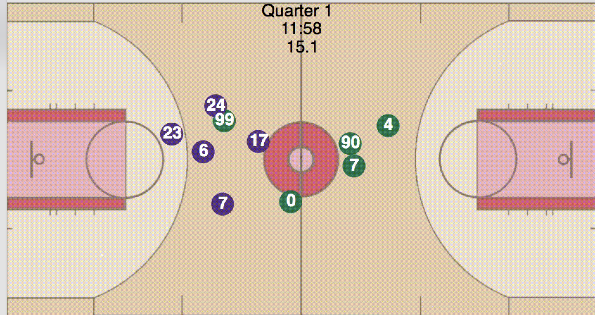
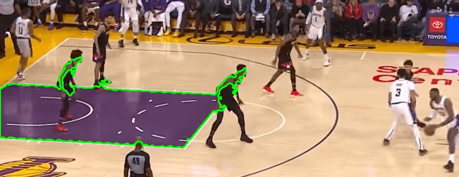
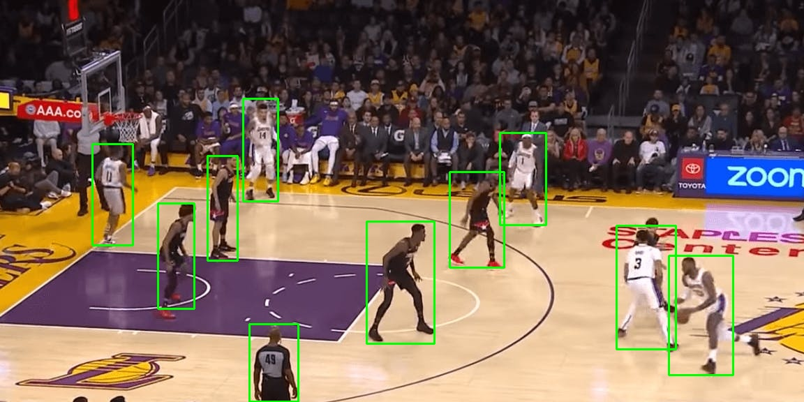
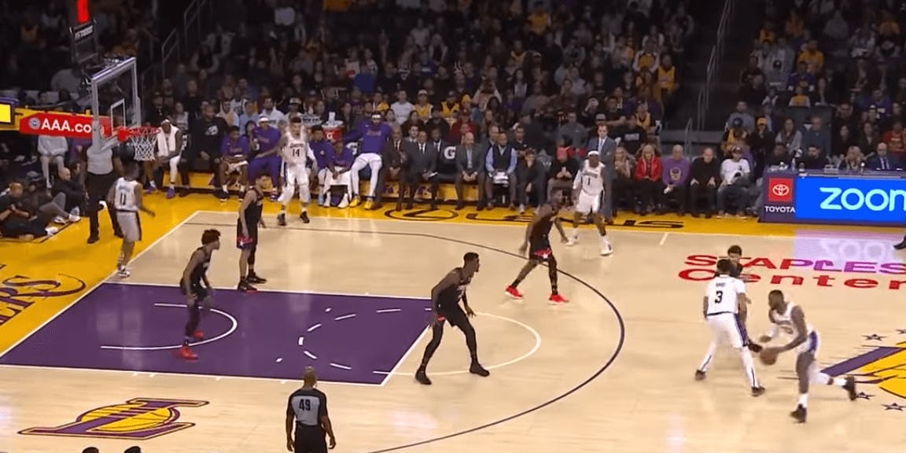
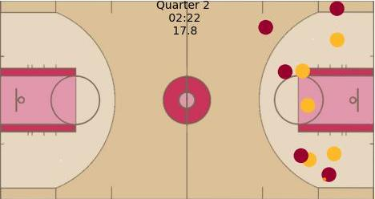

# PlayCaller.ai

## Authors
Arnav Jain, Darin Chaoui, Alex Kim

## Introduction
PlayCaller.ai is a full-stack application that processes raw image inputs from NBA basketball games to classify the offensive and defensive favorabilities of plays. Developed using React.js and Python, the backend utilizes a unique image processing algorithm to prepare the game input for a Convolutional Neural Network (CNN) that performs the classification. This project was built over the course of our 2023 winter break, during which we also generated our own dataset. The following sections detail the quantifiers used in generating the dataset and the overall pipeline.

## Dataset
### Overview
Machine learning with computer vision typically requires either a large amount of complex data and significant computing power or less of both to achieve similar results. Our initial challenge was training our model without paying for cloud computing and dealing with potential issues. We addressed this by using simpler images and a smaller model, both demanding less data.

### Data Collection
We scraped individual JPG files from GIFs in the [NBA-Player-Movements](https://github.com/linouk23/NBA-Player-Movements) repository. These images were labeled as either offensive (1) or defensive (0) and stored in a CSV file for training.

### Data Standardization
To standardize the training data categorization, we considered the following criteria:
- **Offensive Favorability:** Spacing, shot selection, isolation, and rebounding mismatches.
- **Defensive Favorability:** Matchups, trapping, shot difficulty, and transition defense.

The resulting dataset was 56.78% favoring the offense. Key criteria included spacing and rebounding mismatches, as good spacing indicates the threat of three-pointers, and favorable rebounding positioning often leads to extra possessions and easy putbacks. Isolation plays were considered favorable due to the assumption of advantageous matchups.

## ML Pipeline
### Overview
Our pipeline for processing and classifying raw footage involved multiple steps: player detection, court mapping using distinct court features, and plotting player positions on a standard 2D court.

### Player Detection
The image processing pipeline begins with player detection using the YOLOv4 model trained on the COCO dataset. To minimize detection of extraneous elements (e.g., crowd, broadcasting booth), we implemented a cropping function.

### Court Mapping
- **Paint Detection:** Using the cropped image, the `find_paint_by_color_concentration` function detects the paint based on its distinct color from the rest of the court. The paint's diagonal is calculated to find a midpoint, which is translated to find an accurate point underneath the basket.
- **Player Positioning:** Vectors are cast from the basket to each player, rotated based on the angular displacement between the midpoint and basket. Player positions are adjusted using a scale factor derived from the paint's dimensions in the raw image and the standard court image, then assigned a “home” (red) or “away” (yellow) color.

### Classification
The processed image is input to a fine-tuned ResNet18 model, which outputs a percentage of offensive and defensive favorability. This result is displayed on the web page as the final result.

## Conclusion
PlayCaller.ai successfully demonstrates the potential of combining computer vision and machine learning to analyze and classify basketball plays. Our unique approach to dataset generation and image processing ensures efficient and accurate classification, making it a valuable tool for basketball analysis.
